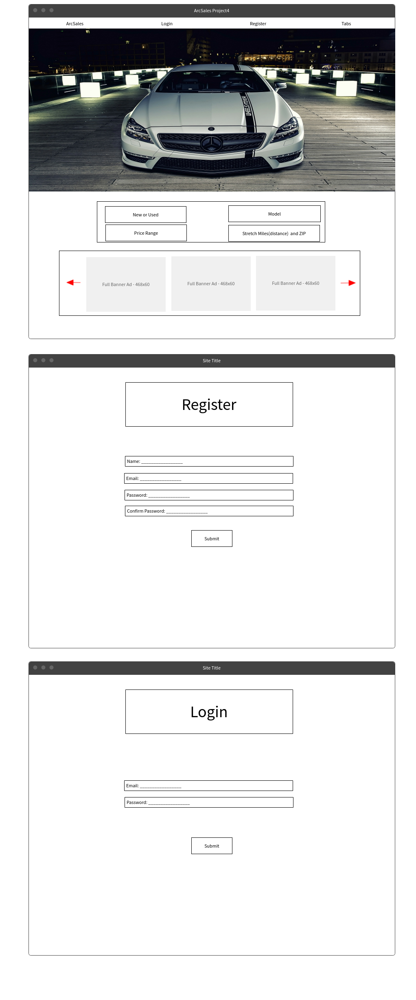
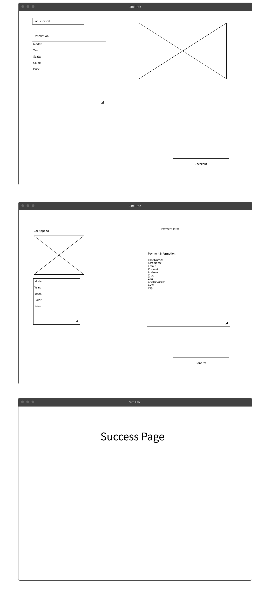
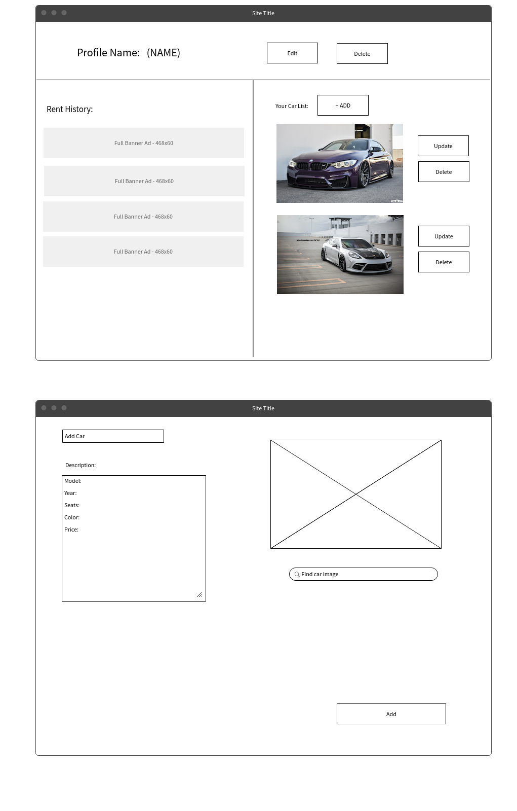

# ArcSales-Benz   
<a href="https://arcsales-frontend.herokuapp.com/" target="_blank">ArcSales Heroku</a>

**Intro to this project**

---

## Big Goals for this Project

###### What did I want to learn and acheive?

* I wanted to make sure that I will ask a tremendous amount of questions on this project. 
* Identify key areas of my own weakness.
* Tackle React with the emphasis of learning as much as possible within the short given time frame.
* Focus on mapping the code out frontend and backend.

---

## Technologies

###### Tech

* React
* Node.js
* Javascript
* HTML/CSS
* React Boostrap
* Express
* Postman
* DBglass
* MongoShell
* Heroku

## Installation Steps

* **Frontend:** npm start
* **Backend**:
    * npm init
    * npm  i express mongoose body-parser express-session dotenv cors connect-mongo bcryptjs
    * npm run dev

* **MongoShell**:
    * show dbs
    * use <database Name>
    * show collections
    * db.<category>.find() or db.<category>.find().pretty()

---

## Planning

###### Project Planning

* **Scope:** Continue the legacy of ARC. Make a chain of projects that can bring life to my own enjoyment of cars.

* **User Stories:** Car enthusiats, needing car service, and buying cars. <a href="https://trello.com/b/QyBPfHkB/arcsales-project4" target="_blank">Trello ArcSales</a>

* **Wireframes:** 

  

 

---

## Continuation

###### More to do

* I will definitely want to make the filter for searching and filtering through the car selection.
* Make a purchasing page.
* Rerendering issue for the AddCar function and finish update and delete for the AddCar model.
* Populate the table on profile page with purchased cars.
* Setup a comment section for each car for all users to talk to one another.
* Incorporate Vin# to hunt down the real specs of the car. Might be able to get an -api.
* Later on even a google maps popup modal to get the cars location showing on google maps.

